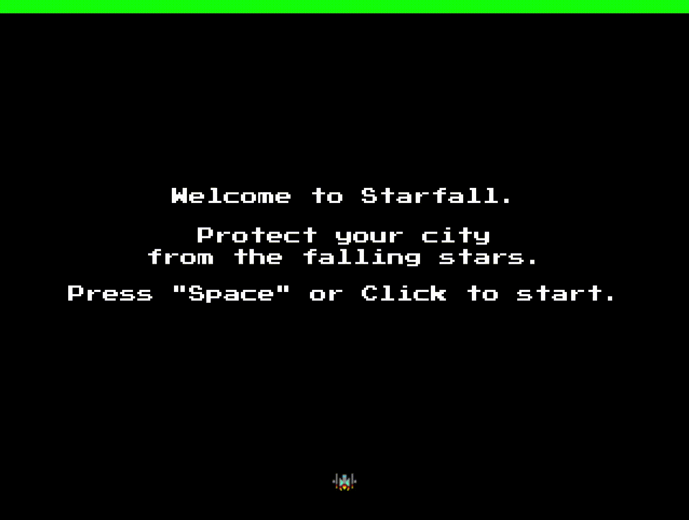

## Star-fall
**Star-fall** is a fast-paced star shooter written in JavaScript and inspired by the 80's arcade game Galaga*. The aim is to score as many points as possible by destroy an ever-increasing wave of stars before they hit the city.

## Technologies
Star-fall is built using ES6 syntax JavaScript and the p5.js libraries. p5.js is used for HTML5 canvas rendering and p5.play deals with the sprite class and handles collision detection.

## Live
[Click here for the Live version](http://davidsh.in/star-fall)

## Preview

## Controls
* ← and → to Move
* Z to Shoot
* P to Pause

## Future Features
* Replenish Life features
* Power-ups
* Bosses
* Sound Effects

## Author

[David Shin](https://github.com/davidyshin)

## Acknowledgements

[Helen Cho](https://github.com/helencho)
