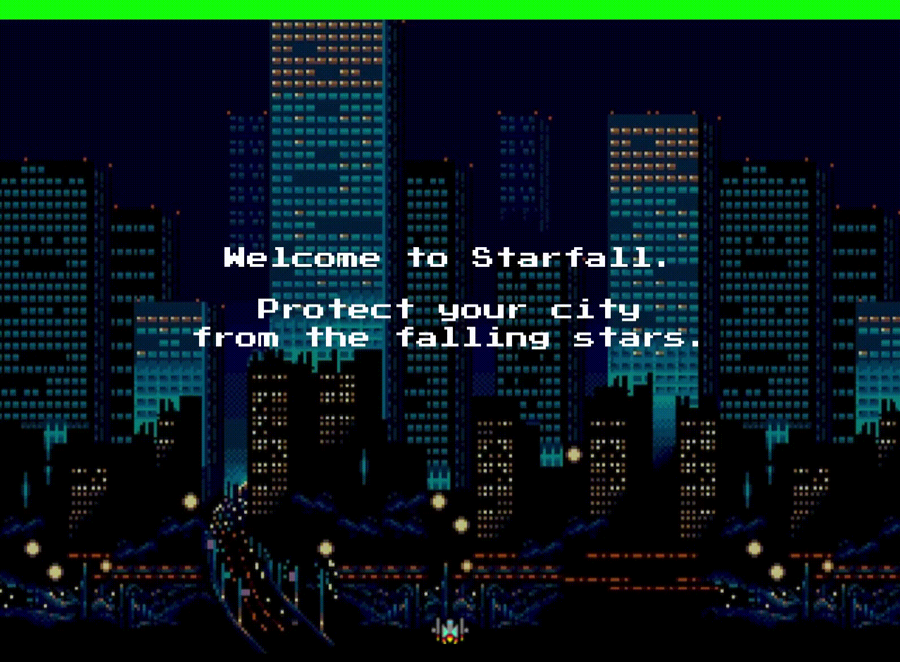
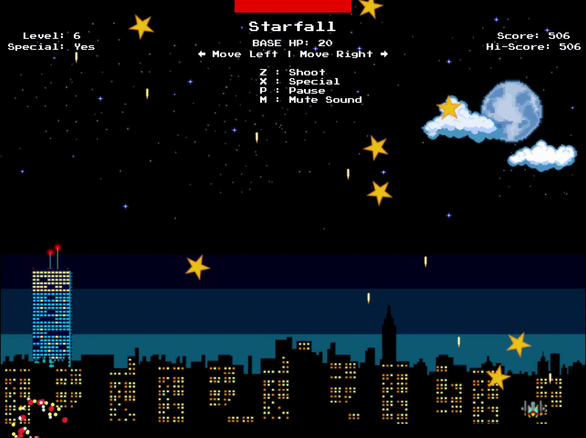

## Star-Fall
**Star-Fall** is a fast-paced star shooter written in JavaScript and inspired by the 80's arcade game **Galaga**. The aim is to score as many points as possible by destroy an ever-increasing wave of stars before they hit the city.

The game is simple. Move your ship, and shoot the stars. Try to grab the falling hearts to replenish life, and use your special move ("x") sparingly in dire situations.

Good luck.

## Live
[Click here for the Live version](http://davidsh.in/star-fall)

## Technologies
Star-Fall is built using ES6 syntax JavaScript and the p5.js libraries. p5.js is used for HTML5 canvas rendering and p5.play deals with the sprite class and handles collision detection.

## Preview

## Controls
* ← and → to Move
* Z : Shoot
* X : use Special
* P : Pause
* M : Mute sound

## Future Features
* Better graphics
* More Power-ups
* Bosses

## Author

[David Shin](https://github.com/davidyshin)

## Acknowledgements

[Helen Cho](https://github.com/helencho)
