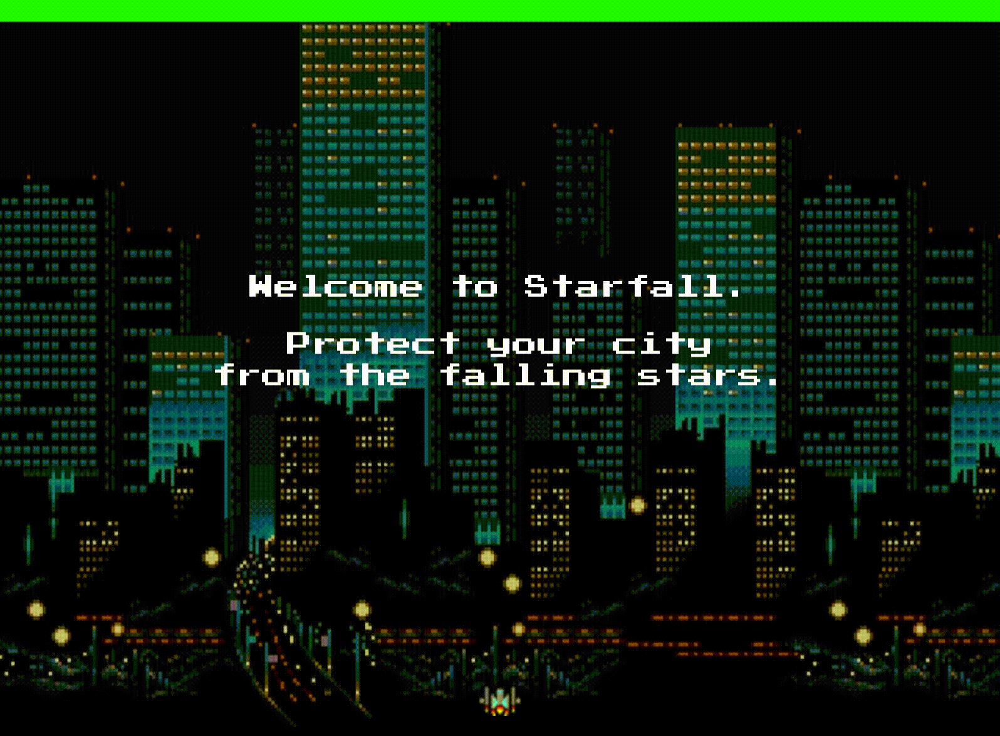
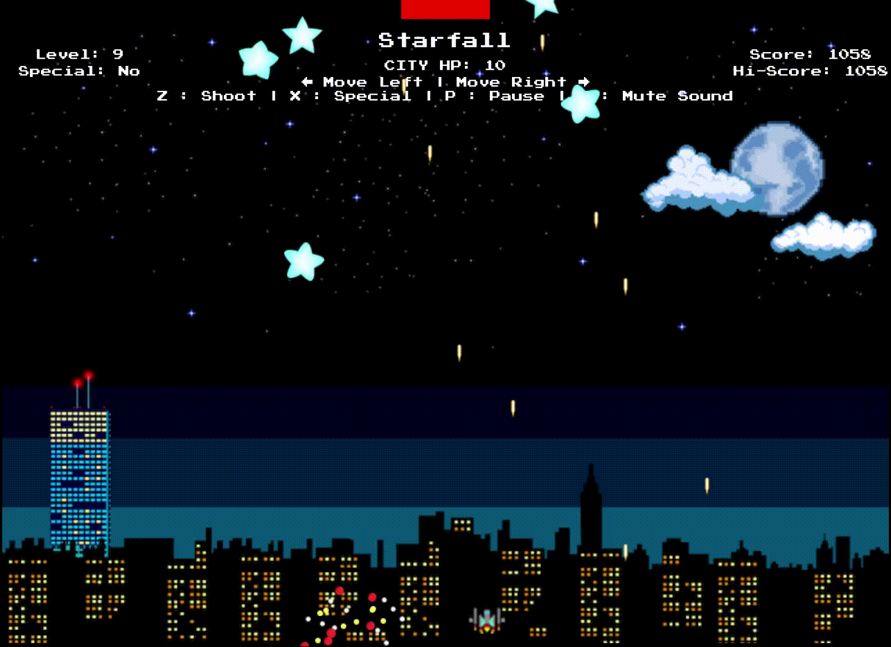

# Starfall

**Current release: 1.1.7**

[Play the live version](https://starfall.netlify.app)

Starfall is a fast-paced JavaScript shooter inspired by 1980s arcade games such as **Galaga**. Destroy the falling stars before they hit the city, collect hearts to restore its health, and save your special attack for emergencies.

The game is endless: waves, score targets, and recurring boss encounters continue for as long as the city survives.



## Run locally

Serve the repository with any static web server, then open its local URL. For example:

```sh
python3 -m http.server 8000
```

Then visit <http://localhost:8000>. Stop the server with <kbd>Ctrl</kbd>+<kbd>C</kbd>.

The game uses vendored p5.js, p5.sound, and p5.play builds, so no package installation is required.

## Preview




## Controls

- <kbd>←</kbd> and <kbd>→</kbd>: move
- <kbd>Space</kbd>: shoot
- <kbd>Z</kbd>: use the special attack
- <kbd>P</kbd>: pause or resume
- <kbd>M</kbd>: mute or unmute

On mobile, rotate to landscape. Firing is automatic; use the corner arrows to move and the on-screen buttons for the special attack, pause, and guide.

Your high score is saved in the browser.

## Gameplay features

- Consecutive hits build a combo multiplier of up to 5×. Taking a hit resets it.
- Blue stars are fast, green stars are armored, and red stars weave as they fall.
- Destroyed stars can drop color-coded rapid fire, spread shot, slow time, or a three-hit shield. Their colors and effects are explained in the game information panel.
- Hits charge the special meter; press <kbd>Z</kbd> when it reaches 100%.
- Every fifth wave becomes a dedicated boss encounter with no regular stars. Bosses move and fire energy shots that only collide with the ship; one direct hit ends the run.
- Screen shake, flashes, particles, and wave announcements provide combat feedback.

## Author

[David Shin](https://github.com/davidyshin)

## Acknowledgements

[Helen Cho](https://github.com/helencho)

Boss and power-up sprites are CC0 assets from OpenGameArt:

- [SpaceShip Boss Set](https://opengameart.org/content/spaceship-boss-set) by The_Scientist___
- [Spaceship Bullet](https://opengameart.org/content/spaceship-bullet) by vergil1018 (CC0)
- [Powerup (Animated Orb)](https://opengameart.org/content/powerup-animated-orb) by jcrown41
